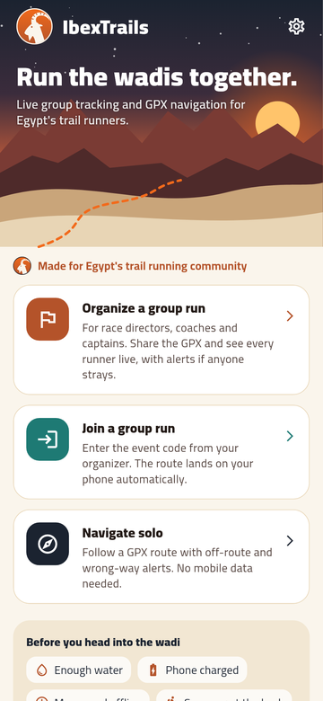
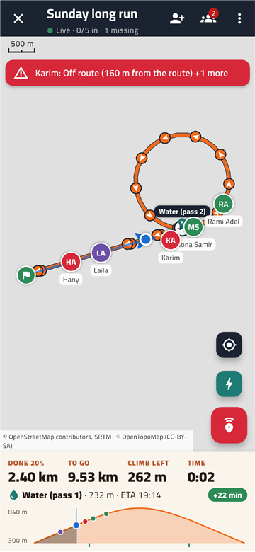
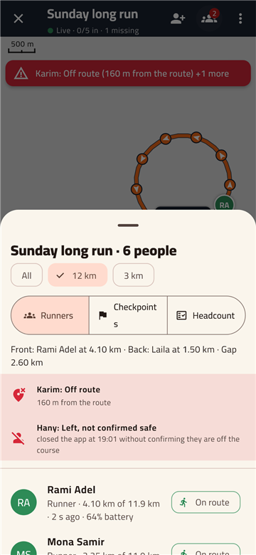
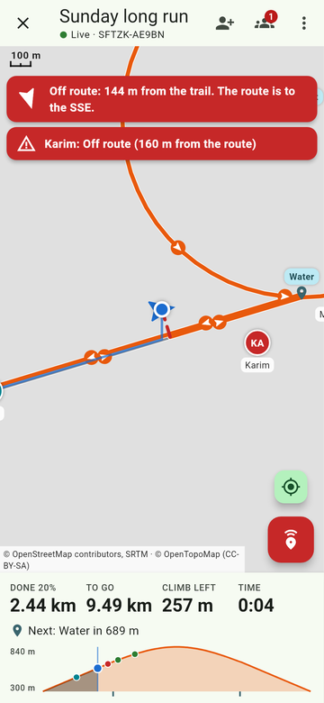
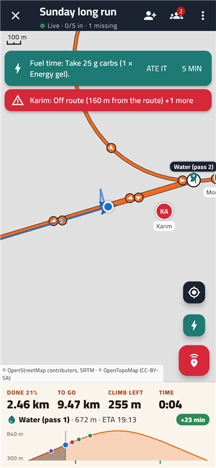
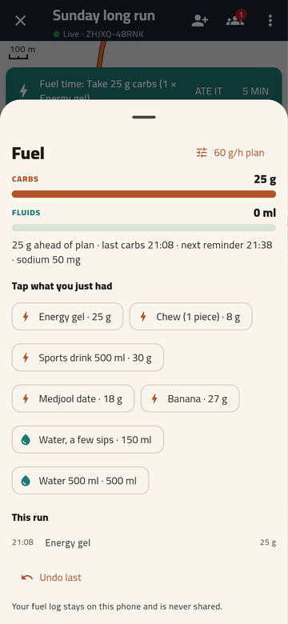
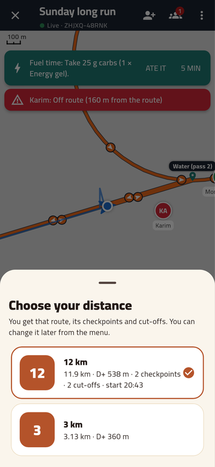
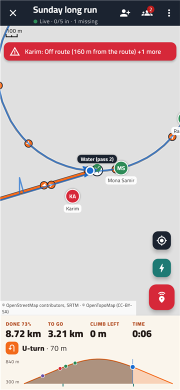
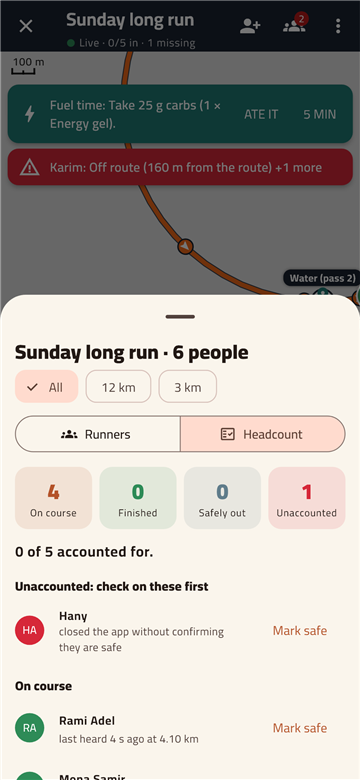
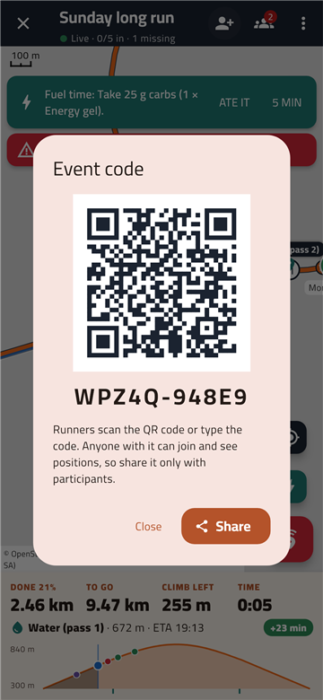

# IbexTrails

**Run together. Never lose the trail.**

A free phone app for group trail runs. The organizer shares a GPX route and
sees every runner live on a map. Each runner gets turn-by-turn-style route
following with a loud alert when they leave the trail. There are no accounts,
no subscriptions and no website to log into. It is a native Android/iOS app
built with Flutter.

| Home | Organizer view | Group list | Off route |
|---|---|---|---|
|  |  |  |  |

| Checkpoint & fuel reminder | Fuel log | Choose your distance |
|---|---|---|
|  |  |  |

| Turn warning | Headcount | Join by QR |
|---|---|---|
|  |  |  |

*(Screens rendered in the test harness, where map tiles are not downloaded, so
the map background is blank. On a phone you see OpenTopoMap/OpenStreetMap.)*

## What it does

**For every runner**
- **GPX navigation.** Load any `.gpx` file (from Strava, Komoot, Garmin,
  Wikiloc and so on). You see the route, arrows showing which way to run,
  waypoints, and your position.
- **Warnings before turns.** The app finds the sharp turns, U-turns and
  switchbacks in the GPX itself. About 60 m before each one the phone
  vibrates and says it out loud ("Sharp left in 60 metres"), over your music
  and with the screen off. The next turn also shows under the stats. It
  helps you avoid a wrong turn instead of only warning you afterwards.
- **Off-route alarm.** If you drift more than 50 m (you can change this) from
  the trail, the phone vibrates and shows a notification, even in your pocket
  with the screen off. It also tells you which direction the trail is (e.g.
  "The route is to the SSE"), and a dashed line on the map leads you back.
- **Wrong-way alarm.** Warns you when you start running back along the route.
- **Progress.** Shows distance done and to go, climbing left, the next waypoint
  ("Water in 2.3 km"), and an elevation profile with your position on it.
- **Works without mobile data.** The route and navigation run entirely on the
  phone. Use **Save map for offline** before you leave coverage.
- **Checkpoints and cut-offs.** Shows the next checkpoint, your projected
  arrival and how much time you have before its cut-off ("+23 min"). It warns
  you when your pace puts you behind a cut-off. Arrival times use
  **km-effort** (the ITRA measure where 100 m of climbing counts as 1 km on
  the flat), so they stay realistic on hilly courses.
- **Fuelling reminders.** Set a carb target (e.g. 60 g per hour) and a fluid
  target, and list what you carry: gels, chews, dates, drinks, with the carbs
  from their labels. The phone buzzes when it's time, saying how much and
  what to eat ("25 g carbs: 1 × Energy gel"). **Ate it** / **In 5 min**
  buttons work from the lock screen. Falling behind? The next reminder asks
  for a bit more, capped so you don't overload your gut. If an aid station is
  only a few minutes away, the reminder waits until you get there. Your fuel
  log stays **private on your phone**.
- **SOS screen.** Mark yourself as needing help to the whole group, call or
  **text your coordinates by SMS** to the organizer (SMS often gets through
  when data doesn't), or share your location through any app.

**For the organizer (and sweepers)**
- Create an event, and you get a code like `K7MPQ-W3XZA`. Share it in the
  group chat.
- Runners **join by scanning a QR code** on your phone at the start line.
  They can also paste or type the code.
- The route is **sent to everyone's phone automatically** when they join.
- **Headcount.** You can see who is on the course, who has finished, who
  dropped out safely, and who is unaccounted for. Unaccounted means they
  closed the app without confirming they're safe, or have had no signal for
  15 min. The app bar reads "12/15 in · 1 missing". A runner who leaves
  early must tap *I'm safely off the course*. You can mark someone safe
  yourself ("Picked up by car"), and sweepers see the same list. You get a
  notification when everyone is accounted for, and an alert if a runner
  falls behind the last sweeper.
- **Multi-distance races.** Add one GPX per distance (e.g. 10 / 25 / 50 km).
  Runners choose theirs when joining, and the group list can be filtered by
  distance.
- **Checkpoints with cut-offs**, taken from the GPX waypoints or added by
  hand. Each distance can have its own start (wave) time. The **Checkpoints**
  tab shows who has passed each checkpoint and when, who is still out, and
  who missed a cut-off.
- A live map of everyone, plus a list sorted by distance along the route
  (front runner, last runner, gap). The elevation profile shows where everyone
  is on the climb.
- **Alerts** when someone goes **off route**, heads the **wrong way**, presses
  **SOS**, has had **no signal** for 5 min, **hasn't moved** for 10 min,
  **missed a cut-off** or is **behind cut-off pace**, or has a **low
  battery**. Tap an alert to see that runner's breadcrumb trail on the
  map, which shows exactly where they took the wrong turn.
- **Message the group** ("Regroup at the water point").
- **End event** removes everything from the relay afterwards.

## How it works (and why it's free)

```
 runner phones  ──►  MQTT relay (free public broker)  ──►  organizer phone
                     sees only encrypted bytes
```

- Phones talk through an **MQTT relay**. By default this is the free public
  EMQX broker. HiveMQ and Mosquitto are one tap away in Settings, or your group
  can run its own.
- Everything is **end-to-end encrypted** (AES-256-GCM). The key is derived
  from the event code, and the relay topic is a hash of it. The relay operator
  can't read positions, and nobody without the code can read or fake messages.
- Positions are sent every 20 s (configurable). Status changes (off route, SOS)
  are sent immediately. If a runner loses signal, the points recorded
  meanwhile are sent when they reconnect, so the organizer still sees the path
  they took.
- Map tiles come from OpenTopoMap/OpenStreetMap and are cached on the phone.

## Getting the app

### Android: download the APK
Every push builds an APK on GitHub Actions:
**Actions → Build → latest run → Artifacts → `IbexTrails-android`**. Unzip it
and install `IbexTrails.apk`. You need to allow "install unknown apps" for your
browser or file manager.

To make a release that group members can download from the **Releases** page,
push a tag:

```sh
git tag v0.1.0 && git push origin v0.1.0
```

> The APK is signed with a debug key. That is fine for sideloading within your
> group. To publish on Google Play, set up a release signing key
> ([guide](https://docs.flutter.dev/deployment/android#sign-the-app)).

### iPhone
Apple doesn't allow sideloading like Android does. You need a Mac with Xcode:
connect the iPhone and run `flutter run --release`. A free Apple ID works, but
the app then expires after 7 days. For group distribution, use TestFlight
(needs the $99/year Apple Developer Program).

### Build from source
```sh
# Flutter 3.47+ (https://docs.flutter.dev/get-started/install)
flutter pub get
flutter run                 # on a connected phone
flutter build apk --release # Android APK
```

## Using it on a group run

1. **Organizer:** *Organize a group run* → name it → add a GPX for each
   distance. Tap a distance to set its start time, checkpoints and cut-offs →
   *Create event*. Share the code. Optionally add your phone number so runners can
   call or text you from the SOS screen.
2. **Everyone else:** *Join a group run* → scan the organizer's QR code (or
   paste the code) → enter your name →
   *Runner* or *Sweeper*. Pick your distance; the route appears
   automatically. Set your **Fuel plan** (home screen) before the start.
3. **Before leaving coverage:** menu → *Save map for offline*.
4. **Android phones:** when asked, allow location *while using the app* and
   allow notifications. On Xiaomi, Huawei, Samsung and similar phones, also set
   **Battery → No restrictions** for IbexTrails, so tracking doesn't stop with
   the screen off.
5. **After the run:** check the **Headcount** (tap the line under the event
   name) until it says everyone is accounted for. Then tap ✕ → *End event*. Anyone can export
   their own track as GPX from the menu.

Tip: do a short test loop around the block first. Walk 60–70 m off the route to
feel the alarm.

## Limitations

- Live group tracking needs **mobile data** at least now and then. Navigation
  and off-route alerts don't. When there's no data at all, the SOS screen's SMS
  option is the fallback.
- The public brokers are free community services with no uptime guarantee.
  For important events, consider a self-hosted Mosquitto or a free HiveMQ Cloud
  / EMQX Serverless instance (Settings → Custom relay).
- Anyone who has the event code can see the group's positions, so share it
  only with participants. Each run gets a new code.
- Tile servers are volunteer-run. Offline saving is limited to a narrow
  corridor along the route, as their usage policies ask.

## Branding

The look (a desert palette, the ibex emblem, the landscape header and the
Cairo font) lives in **`lib/brand.dart`**:

- `Brand` holds the app name, tagline, community line, suggested event names
  and colours. Change them there and the whole app follows.
- The ibex emblem (`IbexBadge`), the home screen landscape (`DesertBackdrop`)
  and the launcher icon art (`AppIconPainter`) are drawn in code. They're
  original artwork, not a club logo. To use an official logo instead,
  replace `IbexBadge` with an `Image.asset`.
- To regenerate the launcher icons after changing the art:

  ```sh
  IBEX_ICON_OUT=/tmp/icon.png flutter test test/tool/app_icon_test.dart
  # then resize /tmp/icon.png into android/app/src/main/res/mipmap-*/ic_launcher.png
  # and ios/Runner/Assets.xcassets/AppIcon.appiconset/ (sizes in Contents.json)
  ```

The app is meant for the Wadi Ibex / Ultra Ibex trail community. Get the
clubs' written permission before publishing with their names or logos.
`Brand.communityLine` shows how to switch the wording once they approve.

Fonts: [Cairo](https://github.com/Gue3bara/Cairo) (SIL Open Font License,
`assets/fonts/OFL.txt`). It covers Latin and Arabic.

## Development

```
lib/
  core/        pure Dart: GPX parsing, route model, route matching,
               encryption, wire protocol, group/alert logic
  services/    GPS, MQTT relay, notifications, map tiles, settings, storage
  state/       RunSession: ties navigation + group tracking together
  ui/          screens and widgets
test/
  core/        unit tests
  integration/ end-to-end group run over a real MQTT broker
  screenshots/ renders the main screens to PNG
```

```sh
flutter analyze
flutter test                                     # unit tests
mosquitto -p 18830 -d                            # local broker, or with Docker:
# docker run -d --rm --name ibex-test-mqtt -p 18830:1883 eclipse-mosquitto:2 mosquitto -c /mosquitto-no-auth.conf
IBEX_TEST_BROKER=127.0.0.1:18830 flutter test test/integration
IBEX_TEST_BROKER=127.0.0.1:18830 IBEX_SCREENSHOTS=/tmp/shots \
  flutter test test/screenshots
```

The route matcher (`lib/core/route_matcher.dart`) is the heart of the
navigation. It tracks progress along the route within a window around your
last position. That way out-and-back routes, lollipops and figure-eights
(where the same trail is used twice) match the correct pass. It uses
hysteresis and GPS-accuracy-aware thresholds, so a single bad fix under trees
doesn't set off the alarm.

Ideas for later: QR code joining, voice prompts, an Android home-screen widget,
Bluetooth/LoRa mesh (e.g. Meshtastic) for areas with no coverage at all, and
ETA per runner.

Map data © OpenStreetMap contributors. Topo map style © OpenTopoMap
(CC-BY-SA).
